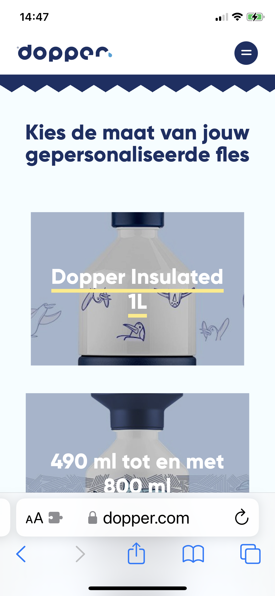
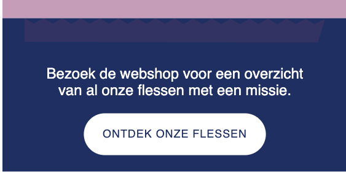

# Procesverslag
Markdown is een simpele manier om HTML te schrijven.  
Markdown cheat cheet: [Hulp bij het schrijven van Markdown](https://github.com/adam-p/markdown-here/wiki/Markdown-Cheatsheet).

Nb. De standaardstructuur en de spartaanse opmaak van de README.md zijn helemaal prima. Het gaat om de inhoud van je procesverslag. Besteedt de tijd voor pracht en praal aan je website.

Nb. Door *open* toe te voegen aan een *details* element kun je deze standaard open zetten. Fijn om dat steeds voor de relevante stuk(ken) te doen.

## Jij

  
uitwerken voor kick-off werkgroep

  ### Auteur:
  Brigitte van Vliet 

  #### Je startniveau:
  Blauw 

  #### Je focus:
  Surface plane 
 

## Je website

  
uitwerken voor kick-off werkgroep

  ### Je opdracht:
  link naar de website die je gaat namaken: https://dopper.com/nl

  #### Screenshot(s) van de eerste pagina (small screen): 
  Home 
  
  

  #### Screenshot(s) van de tweede pagina (small screen):
  Shop  
  
 
 

## Toegankelijkheidstest 1/2 (week 1)

  
uitwerken na test in 2e werkgroep

  ### Bevindingen
  Lijst met je bevindingen die in de test naar voren kwamen:
  - Er worden andere gestures gebruikt.
  - Er wordt snel voorgelezen
  - Wanneer ik met de tab-knop door de homepagina ga, vertelt de voice-over alleen over de klikbare links & buttons.
  - Wanneer ik met de tab-knop door de shoppagina ga, vertelt de voice-over alleen over de links & buttons en  de kleurbolletjes bij de producten waar je verschillende kleurkeuzes hebt.
  - Wanneer ik met de pijltjes door de homepagina ga, vertelt de voice-over niet over alle afbeeldingen, sommige woorden/getallen woorden letter voor letter/cijfer voor cijfer voorgelezen. Ook over de video wordt niks vertelt.
  -  Wanneer ik met de pijltjes door de shoppagina ga, vertelt de voice over wel over de afbeeldingen, sommige woorden/getallen woorden letter voor letter/cijfer voor cijfer voorgelezen.

  #### Foto(s) van de WCAG checklist:
  
 
  
   
    
 

## Breakdownschets (week 1)

  
uitwerken na afloop 3e werkgroep

  Miro : https://miro.com/app/board/uXjVNNsMhI8=/?share_link_id=299988696544
  ### de hele pagina: 
  

  ### dynamisch deel (bijv menu): 
  

  ### wellicht nog een dynamisch deel (bijv filter): 
  

## Voortgang 1 (week 2)

  
uitwerken voor 1e voortgang

  ### Stand van zaken
  hier dit ging goed & dit was lastig (neem ook screenshots op van delen van je website en code)
  - De theorie was een beetje weggezakt van internetstandaarden.
  - Headings bepalen vindt ik lastig.
  
  - Bedenken met wat en hoe ik een bepaalde layout maak, vind ik lastig.
  - Ik ben niet bekend met overlays. Ik heb meerdere foto's op mijn website waar er bovenop een tekst staat.
  - Ik weet even niet zo goed hoe ik deze lijst moet doen want er is 1 georderdende lijst en die heeft weer een ongeordende lijst.
    

  ### Agenda voor meeting
  samen met je groepje opstellen

  | student 1      | student 2          | student 3    | student 4        |
  | ---            | ---                | ---          | ---              |
  | dit bespreken  | en dit             | en ik dit    | en dan ik dat    |
  | en dat ook nog | dit als er tijd is | nog een punt | dit wil ik zeker |
  | ...            | ...                | ...          | ...              |

  De vragen zijn 1 op 1 besproken, dus daarom is dit een beetje leeg.
  ### Verslag van meeting
  hier na afloop snel de uitkomsten van de meeting vastleggen

  - Een 2 heading mag wel gewoon na een 3 heading weer worden gebruikt.
  - Ul en li door elkaar gehaald. 

## Voortgang 2 (week 3)

  
uitwerken voor 2e voortgang

  ### Stand van zaken
  hier dit ging goed & dit was lastig (neem ook screenshots op van delen van je website en code)
  - CSS over het algemeen vind ik erg lastig. Ik vind moeilijk om ergens te beginnen.
  - Door gebruik van selectoren pagina 2 dezelfde stijl...?
  - Hoe geef ik stukjes in tekst een andere kleur?
  - Hoe los ik een bep stukje code op?

  ### Agenda voor meeting
  samen met je groepje opstellen

  | student 1      | student 2          | student 3    | student 4        |
  | ---            | ---                | ---          | ---              |
  | dit bespreken  | en dit             | en ik dit    | en dan ik dat    |
  | en dat ook nog | dit als er tijd is | nog een punt | dit wil ik zeker |
  | ...            | ...                | ...          | ...              |
  De vragen zijn 1 op 1 besproken, dus daarom is dit een beetje leeg.

  ### Verslag van meeting
  hier na afloop snel de uitkomsten van de meeting vastleggen

  - 2 navigaties
  - Divjes gebruiken
  - Span gebruiken

## Toegankelijkheidstest 2/2 (week 4)

  
uitwerken na test in 9e werkgroep

  ### Bevindingen
  Lijst met je bevindingen die in de test naar voren kwamen (geef ook aan wat er verbeterd is):

## Voortgang 3 (week 4)

  
uitwerken voor 3e voortgang

  ### Stand van zaken
  hier dit ging goed & dit was lastig (neem ook screenshots op van delen van je website en code)
  - Nadat ik mijn navbar zo werkend had gemaakt dat deze veranderende met scrollen, werkte het hamburger menu niet meer.
  - Ik heb erg moeite met de selectoren, want soms luistert het niet naar de 2e selector maar naar de 1e, terwijl ik ze heel specifiek maak.
  - Toen ik ging beginnen met de 2e pagina kwam ik tot de conclusie dat het toch niet zo handig was, dat ik alleen maar gebruik gemaakt had van selectoren en geen divjes, classes of id's gebruikt had. Hierdoor bleef alles maar luisteren naar die selectoren. Maar op pagina 2 moest er weer hele andere stylings dingen gebeuren.
  - Het ol li cijfer voor de h3 krijg, terwijl er met de ul li niks gebeurt. Dit was erg lastig. Ik heb chatGPT vragen geprobeert te stellen, chatGPT kwam zelf met code voor ol li::before. 
   en door de inspectator heb ik wat geprobeerd met transform en ook wat met ol li::marker. Maar dit allemaal werkte niet.
  
  Ik heb nu de ol li list-style op none gezet en bij de h3 de cijfers gewoon erbij gezet en zo kreeg ik wel het gewenste resultaat.
  
  - Het zigzag patroontje boven bepaalde sections lukt me ook niet. Ik heb eerst iets in illustrator gemaakt, maar hierbij krijg ik gewoon niet de juiste matchende kleur. Vervolgens heb ik geprobeerd met wat codes van het internet op een zigzagpatroon te maken met css, maar ook dit lukte me niet.
 

  ### Agenda voor meeting
  samen met je groepje opstellen

  | student 1      | student 2          | student 3    | student 4        |
  | ---            | ---                | ---          | ---              |
  | dit bespreken  | en dit             | en ik dit    | en dan ik dat    |
  | en dat ook nog | dit als er tijd is | nog een punt | dit wil ik zeker |
  | ...            | ...                | ...          | ...              |

  ### Verslag van meeting
  Helaas vanwege ziek zijn ben ik niet bij de meeting geweest.

  hier na afloop snel de uitkomsten van de meeting vastleggen

  - punt 1
  - punt 2
  - nog een punt
  - ...

## Eindgesprek (week 5)

  
uitwerken voor eindgesprek

  ### Je uitkomst - karakteristiek screenshots:
  
  
  
  

  ### Dit ging goed/Heb ik geleerd: 
  Korte omschrijving met plaatjes

  

  ### Dit was lastig/Is niet gelukt:
  Korte omschrijving met plaatjes
  - Hamburger menu werkend maken met klikken
  - De bewegende image
  - De footer perfect namaken
  - Surface plane
  

## Bronnenlijst

  
continu bijhouden terwijl je werkt

  Nb. Wees specifiek ('css-tricks' als bron is bijv. niet specifiek genoeg). 
  Nb. ChatGpT en andere AI horen er ook bij.
  Nb. Vermeld de bronnen ook in je code.

  1. bron 1: https://codepen.io/shooft/live/MWZYoqa
  2. bron 2: https://chat.openai.com
  3. ...

